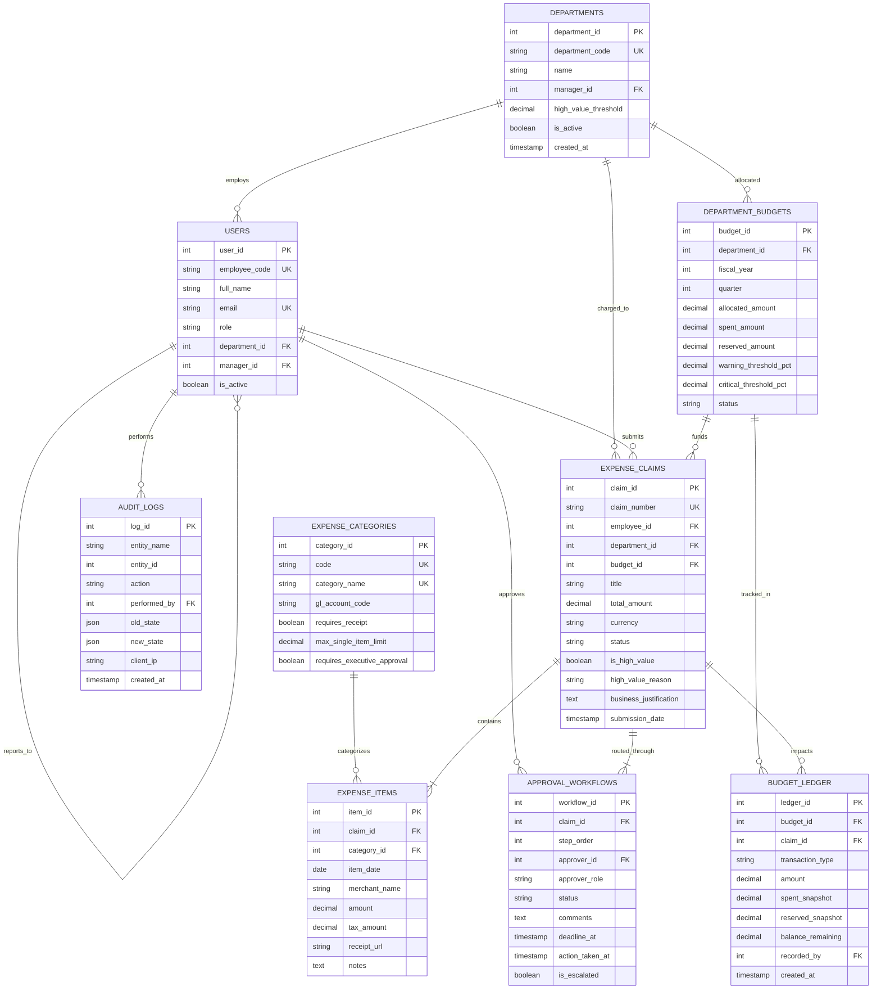
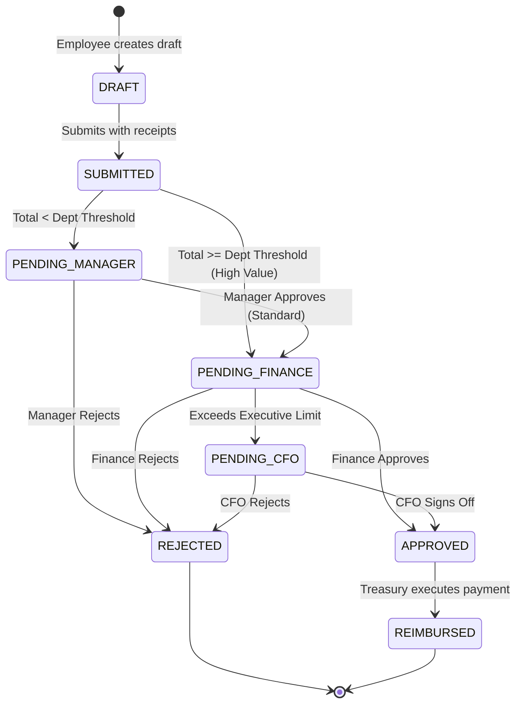

# Enterprise Expense Approval & Department Budget Monitoring System
## Complete Database Architecture & Technical Specification

---

## 1. Executive Summary & Problem Mapping

### The Business Problem
Organizations frequently struggle with manual expense processing characterized by:
1. **Uncontrolled Budget Overruns**: Departments lack real-time visibility into committed vs. available funds, discovering deficits only weeks after money is already spent.
2. **High-Value Expense Blindspots**: Large capital or operational outflows pass through without adequate executive oversight or secondary approval tiering.
3. **Pending Approval Bottlenecks**: Expense receipts languish in email inboxes and spreadsheets with no SLA enforcement, leading to delayed reimbursements and lack of financial forecasting.
4. **Audit & Compliance Gaps**: Absence of immutable transaction logging creates risks of fraud, duplicate submissions, and non-compliance with tax and accounting standards.

### The Architectural Solution
This relational database architecture provides a **3NF-normalized, enterprise-grade schema** featuring:
- **Hierarchical Approval Workflows**: Role-based routing (Manager → Dept Head → Finance/CFO) with SLA deadline computation.
- **Real-Time Budget Ledger**: Double-entry ledger mechanism that tracks **Allocated**, **Reserved** (pre-approval), and **Spent** (post-approval) funds.
- **Configurable High-Value Rules**: Department-specific and category-specific thresholds triggering automated executive escalation.
- **Complete Forensic Auditing**: Change-capture audit trail recording old vs. new JSON states, actors, and timestamps.

---

## 2. Entity-Relationship Diagram (ERD)

---

## 3. Data Dictionary & Table Specifications

### Table 1: `departments`
*Purpose: Master table for organizational divisions and departmental policy rules.*
| Column | Type | Constraints | Description |
|---|---|---|---|
| `department_id` | SERIAL / INT | PRIMARY KEY | Unique department identifier |
| `department_code` | VARCHAR(20) | UNIQUE, NOT NULL | Short code (e.g., 'ENG', 'MKT', 'FIN') |
| `name` | VARCHAR(100) | NOT NULL | Full department title |
| `manager_id` | INT | FOREIGN KEY (users.user_id) | Assigned department director |
| `high_value_threshold` | DECIMAL(12,2) | NOT NULL, DEFAULT 1000.00 | Custom monetary threshold triggering executive review |
| `is_active` | BOOLEAN | NOT NULL, DEFAULT TRUE | Soft-delete / active status |
| `created_at` | TIMESTAMP | DEFAULT CURRENT_TIMESTAMP | Record creation timestamp |

### Table 2: `users`
*Purpose: User accounts, roles, and reporting hierarchy.*
| Column | Type | Constraints | Description |
|---|---|---|---|
| `user_id` | SERIAL / INT | PRIMARY KEY | Unique user ID |
| `employee_code` | VARCHAR(20) | UNIQUE, NOT NULL | Corporate employee identifier (e.g. 'EMP001') |
| `full_name` | VARCHAR(100) | NOT NULL | User's legal name |
| `email` | VARCHAR(150) | UNIQUE, NOT NULL | Corporate email address |
| `role` | VARCHAR(30) | NOT NULL, CHECK (role IN (...)) | Role: EMPLOYEE, MANAGER, DEPARTMENT_HEAD, FINANCE_ADMIN, CFO, AUDITOR |
| `department_id` | INT | FOREIGN KEY (departments) | Primary department membership |
| `manager_id` | INT | FOREIGN KEY (users.user_id) | Direct manager for tier-1 approval hierarchy |
| `is_active` | BOOLEAN | NOT NULL, DEFAULT TRUE | Account operational status |

### Table 3: `department_budgets`
*Purpose: Fiscal period financial allocations and real-time utilization.*
| Column | Type | Constraints | Description |
|---|---|---|---|
| `budget_id` | SERIAL / INT | PRIMARY KEY | Unique budget envelope ID |
| `department_id` | INT | FOREIGN KEY (departments) | Assigned cost center |
| `fiscal_year` | INT | NOT NULL, CHECK (>= 2020) | Financial year (e.g., 2026) |
| `quarter` | INT | NOT NULL, CHECK (BETWEEN 1 AND 4) | Financial quarter (1 to 4) |
| `allocated_amount` | DECIMAL(14,2) | NOT NULL, CHECK (> 0) | Approved quarterly allowance |
| `spent_amount` | DECIMAL(14,2) | DEFAULT 0.00, CHECK (>= 0) | Settled & approved expenses |
| `reserved_amount` | DECIMAL(14,2) | DEFAULT 0.00, CHECK (>= 0) | Encumbered funds for pending approvals |
| `warning_threshold_pct` | DECIMAL(5,2) | DEFAULT 80.00 | Soft threshold triggering warning alerts |
| `critical_threshold_pct`| DECIMAL(5,2) | DEFAULT 95.00 | Hard threshold triggering urgent intervention |
| `status` | VARCHAR(20) | CHECK (status IN (...)) | ACTIVE, FROZEN, CLOSED, DRAFT |
| **Constraint** | UNIQUE | `(department_id, fiscal_year, quarter)` | Prevents duplicate budget envelopes |

### Table 4: `expense_categories`
*Purpose: Accounting classification, General Ledger mapping, and receipt requirements.*
| Column | Type | Constraints | Description |
|---|---|---|---|
| `category_id` | SERIAL / INT | PRIMARY KEY | Unique category ID |
| `code` | VARCHAR(20) | UNIQUE, NOT NULL | Short code (e.g., 'IT-CLD', 'TRV-AIR') |
| `category_name` | VARCHAR(60) | UNIQUE, NOT NULL | Display name |
| `gl_account_code` | VARCHAR(30) | NOT NULL | General Ledger code for ERP sync |
| `requires_receipt` | BOOLEAN | DEFAULT TRUE | Receipt mandatory rule |
| `max_single_item_limit`| DECIMAL(12,2)| NULL | Cap before requiring VP sign-off |
| `requires_executive_approval` | BOOLEAN | DEFAULT FALSE | Policy requiring CFO sign-off |

### Table 5: `expense_claims`
*Purpose: The parent expense report submitted by employees.*
| Column | Type | Constraints | Description |
|---|---|---|---|
| `claim_id` | SERIAL / INT | PRIMARY KEY | Internal claim sequence ID |
| `claim_number` | VARCHAR(30) | UNIQUE, NOT NULL | Human-readable identifier ('EXP-2026-001') |
| `employee_id` | INT | FOREIGN KEY (users) | Claim submitter |
| `department_id` | INT | FOREIGN KEY (departments) | Department funding the expense |
| `budget_id` | INT | FOREIGN KEY (department_budgets)| Associated quarterly budget |
| `title` | VARCHAR(200) | NOT NULL | Purpose/Summary of expense |
| `total_amount` | DECIMAL(12,2) | DEFAULT 0.00, CHECK (>= 0) | Aggregate claim total |
| `currency` | VARCHAR(3) | DEFAULT 'USD' | ISO Currency code |
| `status` | VARCHAR(30) | CHECK (status IN (...)) | DRAFT, SUBMITTED, PENDING_MANAGER, PENDING_FINANCE, PENDING_CFO, APPROVED, REJECTED, REIMBURSED |
| `is_high_value` | BOOLEAN | DEFAULT FALSE | Automated flag based on department threshold |
| `high_value_reason` | VARCHAR(255) | NULL | Justification for high-value escalation |
| `business_justification`| TEXT | NOT NULL | Justification submitted by employee |
| `submission_date`| TIMESTAMP | DEFAULT CURRENT_TIMESTAMP | Submission timestamp |

### Table 6: `expense_items`
*Purpose: Itemized receipts and merchant-level breakdown (1-to-Many with claims).*
| Column | Type | Constraints | Description |
|---|---|---|---|
| `item_id` | SERIAL / INT | PRIMARY KEY | Line item ID |
| `claim_id` | INT | FOREIGN KEY (expense_claims) ON DELETE CASCADE | Parent claim reference |
| `category_id` | INT | FOREIGN KEY (expense_categories) | Expense classification |
| `item_date` | DATE | NOT NULL | Date transaction occurred |
| `merchant_name` | VARCHAR(150) | NOT NULL | Vendor/Merchant name |
| `amount` | DECIMAL(12,2) | NOT NULL, CHECK (> 0) | Pre-tax line item total |
| `tax_amount` | DECIMAL(10,2) | DEFAULT 0.00 | VAT / Sales tax portion |
| `receipt_url` | VARCHAR(500) | NULL | Secure Cloud Storage URL of invoice |
| `notes` | TEXT | NULL | Contextual notes |

### Table 7: `approval_workflows`
*Purpose: Multi-tiered sequential approval workflow with SLA aging.*
| Column | Type | Constraints | Description |
|---|---|---|---|
| `workflow_id` | SERIAL / INT | PRIMARY KEY | Unique workflow step ID |
| `claim_id` | INT | FOREIGN KEY (expense_claims) ON DELETE CASCADE | Target claim |
| `step_order` | INT | NOT NULL, CHECK (>= 1) | Step sequence (1 = Manager, 2 = Finance, 3 = CFO) |
| `approver_id` | INT | FOREIGN KEY (users) | Designated approver user ID |
| `approver_role` | VARCHAR(30) | NOT NULL | Expected role of approver |
| `status` | VARCHAR(20) | CHECK (status IN (...)) | PENDING, APPROVED, REJECTED, SKIPPED, DELEGATED |
| `comments` | TEXT | NULL | Reason for approval/rejection |
| `deadline_at` | TIMESTAMP | NOT NULL | SLA deadline (e.g., 48 hours from step assignment) |
| `action_taken_at`| TIMESTAMP | NULL | Time decision was recorded |
| `is_escalated` | BOOLEAN | DEFAULT FALSE | SLA breach escalation flag |
| **Constraint** | UNIQUE | `(claim_id, step_order)` | Exactly one approver per step sequence |

### Table 8: `budget_ledger`
*Purpose: Double-entry audit ledger tracking every monetary delta.*
| Column | Type | Constraints | Description |
|---|---|---|---|
| `ledger_id` | SERIAL / INT | PRIMARY KEY | Ledger entry sequence ID |
| `budget_id` | INT | FOREIGN KEY (department_budgets)| Impacted budget |
| `claim_id` | INT | FOREIGN KEY (expense_claims) | Associated expense |
| `transaction_type` | VARCHAR(20)| CHECK (transaction_type IN (...))| ALLOCATION, RESERVATION, COMMITMENT, RELEASE, ADJUSTMENT |
| `amount` | DECIMAL(14,2) | NOT NULL | Transaction delta |
| `spent_snapshot` | DECIMAL(14,2) | NOT NULL | Snapshot of spent_amount |
| `reserved_snapshot`| DECIMAL(14,2)| NOT NULL | Snapshot of reserved_amount |
| `balance_remaining`| DECIMAL(14,2)| NOT NULL | Available headroom after transaction |
| `recorded_by` | INT | FOREIGN KEY (users) | Actor triggering entry |
| `created_at` | TIMESTAMP | DEFAULT CURRENT_TIMESTAMP | Ledger entry time |

### Table 9: `audit_logs`
*Purpose: Unalterable compliance, security, and fraud audit trail.*
| Column | Type | Constraints | Description |
|---|---|---|---|
| `log_id` | SERIAL / INT | PRIMARY KEY | Log entry ID |
| `entity_name` | VARCHAR(50) | NOT NULL | Target entity (EXPENSE_CLAIM, BUDGET, etc.) |
| `entity_id` | INT | NOT NULL | Primary key of target record |
| `action` | VARCHAR(50) | NOT NULL | SUBMITTED, APPROVED, REJECTED, BUDGET_ALERT, etc. |
| `performed_by` | INT | FOREIGN KEY (users) | Actor executing the action |
| `old_state` | JSON / JSONB | NULL | Previous state representation |
| `new_state` | JSON / JSONB | NULL | Updated state representation |
| `client_ip` | VARCHAR(45) | DEFAULT '127.0.0.1' | Originating IP address |
| `created_at` | TIMESTAMP | DEFAULT CURRENT_TIMESTAMP | Event log timestamp |

---

## 4. Normalization Justification

| Normal Form | How This Database Architecture Satisfies It |
|---|---|
| **1NF (First Normal Form)** | Every table possesses an explicit atomic Primary Key. All attributes contain single atomic values (e.g. line items are separated into `expense_items` rather than comma-separated lists or unstructured text fields). |
| **2NF (Second Normal Form)** | In full 1NF, and every non-key column is fully functionally dependent on the entire primary key. In composite unique tables (such as `department_budgets` with `(department_id, fiscal_year, quarter)`), there are no partial dependencies. |
| **3NF (Third Normal Form)** | In full 2NF, with zero transitive dependencies. Non-key columns depend **only on the candidate key**. For example, department name and manager are stored in `departments`, not duplicated inside `expense_claims`. Employee department is determined via `users.department_id`, eliminating anomalies. |
| **BCNF (Boyce-Codd Normal Form)** | Every determinant in functional dependencies is a candidate key. |

---

## 5. Lifecycle State Machine & Business Workflows

### 5.1 Expense Claim Lifecycle

### 5.2 Two-Phase Budget Commitment Protocol
To solve the risk of accidental budget overspends during concurrent claims:
1. **Phase 1: Encumbrance (Reservation)**:
   - When a claim is submitted, the system executes:
     `UPDATE department_budgets SET reserved_amount = reserved_amount + :amount WHERE budget_id = :id;`
   - Funds are locked so other claims cannot oversubscribe the department's budget.
2. **Phase 2A: Settlement (Commitment)**:
   - Upon final approval:
     `UPDATE department_budgets SET reserved_amount = reserved_amount - :amount, spent_amount = spent_amount + :amount WHERE budget_id = :id;`
3. **Phase 2B: Release**:
   - If rejected or cancelled:
     `UPDATE department_budgets SET reserved_amount = reserved_amount - :amount WHERE budget_id = :id;`
   - Headroom is immediately restored for other department initiatives.

---

## 6. Indexing & Optimization Strategy

| Index Name | Table & Columns | Optimization Rationale |
|---|---|---|
| `idx_dept_budgets_dept_fy` | `department_budgets(department_id, fiscal_year, quarter)` | Eliminates full table scans on quarterly balance lookups; guarantees O(1) budget verification. |
| `idx_expense_claims_status` | `expense_claims(status)` | Accelerates the Pending Approvals dashboard and SLA monitoring queries. |
| `idx_expense_claims_high_val` | `expense_claims(is_high_value)` | Sub-millisecond filtering for the executive high-value radar view. |
| `idx_approval_workflows_app_stat` | `approval_workflows(approver_id, status)` | Powers personal manager queues: "Show me all claims waiting for my approval". |
| `idx_expense_items_claim` | `expense_items(claim_id)` | Optimized for inner join aggregation when rendering claim details and calculating totals. |
